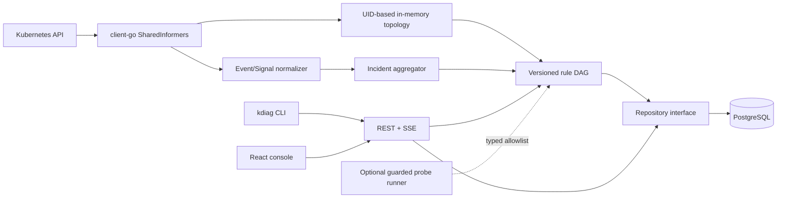

# KDiag

KDiag is an open-source, explainable Kubernetes incident diagnosis, network
troubleshooting, and change-verification platform. It turns repeated symptoms
into Incidents and keeps the reasoning chain visible: what happened, impact,
likely cause, supporting and contradicting evidence, missing evidence,
remediation, and post-fix verification.

> Current release line: v0.4.1. Go and Web verification results are recorded in
> the release notes. Environment-dependent Compose, PostgreSQL, and kind results
> are reported separately and are never inferred from source alone.

[中文说明](README.zh-CN.md) · [Roadmap](docs/ROADMAP.md) ·
[Architecture](docs/architecture/overview.md) · [Security](SECURITY.md)

## Why KDiag

KDiag is not another general-purpose Kubernetes dashboard. Its primary object is
an explainable Incident. A result must distinguish supporting, contradicting,
missing, and neutral evidence. A rule that lacks required facts returns
`NEEDS_MORE_EVIDENCE`; it does not guess. Structured container state,
conditions, reasons, and termination information outrank Event text.

The console supports Chinese and English. Settings shows the effective
`get/list/watch` result for every configured resource kind and can generate a
read-only RBAC manifest for a cluster administrator to review and apply
manually. KDiag never grants itself permissions and never includes Secrets in
that manifest.

## Architecture



## Implemented in this snapshot

- client-go dynamic SharedInformers for Namespace, Deployment, ReplicaSet, Pod,
  Node, Service, EndpointSlice, Event, and PVC, with cache synchronization,
  List-Watch reconnect behavior, delete tombstones, UID identity, and
  OwnerReferences.
- Concurrency-safe in-memory topology with ownership, scheduling, selector,
  EndpointSlice, and PVC relationship types plus neighborhood/service-chain
  queries.
- Event message normalization (IP, port, timestamp, generated Pod suffix),
  stable fingerprints, occurrence aggregation, and same-source Evidence
  deduplication.
- Replaceable Incident aggregator with a tested readiness-failure → Pod
  NotReady → Service unavailable example.
- Thirteen versioned deterministic rules. Every rule has positive, negative,
  and insufficient-evidence tests. Exit code 137 alone never proves OOM.
- Asynchronous REST API and named SSE lifecycle events; PostgreSQL repository
  and versioned migration; in-memory repository for local operation.
- Trusted server-side Observation construction from the live informer cache,
  with plain-language reports that separate confirmed, suspected, healthy, and
  unverified checks.
- React 19 + TypeScript console with overview, Incident list/detail, evidence,
  topology, timeline, resource diagnosis, network diagnosis, and replay views.
- Network path static analysis for source readiness, Service/selectors,
  EndpointSlices, Ready endpoints, numeric/named targetPort, container ports,
  and NetworkPolicy limitations. Active probes are disabled by default.
- `kdiag` API client CLI, Docker Compose, non-root images, Helm Chart, seven
  kind fault manifests, CI/security/release workflows, and Prometheus text
  metrics at `/metrics`.

## Quick start

Prerequisites: Go 1.26, Node 22, pnpm 11, Docker with Compose.

```bash
cp .env.example .env
# Replace the local PostgreSQL password in .env.
docker compose up --build
```

Open `http://localhost:8088`. The Compose path is provided but remains an
unverified release gate on the current development machine.

The verified, database-free API path is:

```bash
go run ./cmd/kdiag-api
go run ./cmd/kdiag doctor
go run ./cmd/kdiag why service/payment -n production
```

Without a live collector snapshot, diagnosis correctly reports missing
evidence instead of a healthy result.

## CLI

```bash
kdiag doctor
kdiag why service/payment -n production
kdiag why pod/payment-7df6d9c8b5-x2k9z -n production --output json
kdiag trace --from frontend --to payment:8080 -n production --protocol HTTP
kdiag replay <incident-id>
```

Use `--server`, `--timeout`, and `--output table|json`. Non-successful requests,
timeouts, invalid input, and failed/cancelled tasks return a non-zero exit code.
The CLI calls the API; it does not contain a second diagnosis engine.

## Web console

- Cluster panorama: auto-connected live inventory, resource-group/
  namespace/state/node/label/text filters, structured health, ownership and
  Service/EndpointSlice/Pod relations, related Events, and a sanitized raw
  object inspector.
- Overview: Incident and severity summary with explicit data-coverage wording.
- Incident list: severity/status/namespace/text filters, sorting, and paging.
- Incident detail: conclusion and impact first; steps, Evidence, topology,
  timeline, remediation, and verification in separate tabs.
- Resource diagnosis: automatically collects live evidence and renders a
  conclusion, impact, root cause, troubleshooting chain, safe remediation, and
  post-fix verification before technical details.
- Network diagnosis: live source/Service/port selection and path-oriented
  static checks with an explicit blocking point and downstream skipped steps;
  active probing remains off.
- Replay: selects a saved Incident and creates a task from its snapshot.
- Policy and alerts, report center, resource topology, and system settings:
  live read-only operational views with honest coverage and empty states.

All Kubernetes object and Incident identifiers used to start a workflow are
selected from live API results and refreshed every 15 seconds; they are not
free-form resource-name inputs.

Raw technical detail is secondary to user-facing language such as “Service
currently has no healthy backend Pods.” Missing data is never rendered as “no
problem found.”

When running inside Kubernetes, the API automatically uses its ServiceAccount.
When run locally, it falls back to the standard kubeconfig loading rules; set
`KDIAG_KUBECONFIG` and `KDIAG_CLUSTER_NAME` to override them. The live
List-Watch inventory currently covers 20 common built-in resource kinds.

## targetPort fault demo

```bash
make kind-up
./deploy/kind/run-e2e.sh targetport
```

The scenario creates a Ready backend on port 8080 and a Service forwarding to
9090. The required diagnosis is `target_port_mismatch`; selector mismatch,
missing Endpoint, and NetworkPolicy denial are forbidden conclusions. The
runner verifies failure, the engine fixture, applies the named-port repair,
verifies recovery, and cleans up. This script is implemented but not yet
executed on the current machine because Docker/kind are unavailable.

## Development and tests

```bash
make help
make bootstrap
make fmt
make lint
make test
make test-integration   # requires KDIAG_TEST_DATABASE_URL and migrated PostgreSQL
make build
make docker-build
make dev
make kind-up
make deploy
make demo
make e2e
make security
```

Locally verified for this snapshot: `go test ./...`, Go API/CLI builds,
frontend lint/typecheck/Vitest/production build, Kubernetes YAML parsing,
`helm lint`, and `helm template`. Docker, Compose, integration PostgreSQL, and
kind E2E are explicitly pending.

## Security model

- Read-only Kubernetes RBAC; Secret bodies are never watched or displayed.
- Watcher, Web, and optional probe runner identities are separable.
- No arbitrary shell execution; probe actions are DNS/TCP/HTTP only,
  time-bounded, concurrency-limited, task-target-allowlisted, and cancellable.
- All API JSON is size-bounded and unknown fields are rejected. SQL is
  parameterized. Logs do not print database URLs or credentials.
- Non-root, read-only containers and Kubernetes SecurityContext defaults.
- The MVP never mutates production resources and active probes default off.
- CI includes dependency, static, secret, filesystem, and image scanning with
  least-privilege workflow permissions.

Important: v0.1 has no built-in authentication or multi-tenant authorization.
Put it behind an authenticated proxy/identity-aware ingress and a restrictive
NetworkPolicy. See [the security policy](SECURITY.md).

## Current limitations

- The live inventory covers 20 common built-in kinds; arbitrary CRD instances
  are not discovered automatically yet.
- An “unknown” resource is visible but does not yet have a health classifier;
  unknown never means healthy.
- The API constructs trusted network snapshots from live informer inventory;
  browser and CLI clients submit only the selected path.
- Static NetworkPolicy reasoning cannot prove CNI dataplane behavior. KDiag
  never claims complete network health without traffic evidence.
- PostgreSQL integration and Compose/kind execution remain environment-limited
  release gates.
- The Web bundle needs route-level code splitting.
- Probe-runner Helm deployment is disabled by default and its separate runtime
  command is not yet shipped.

## Roadmap

The detailed phase status is in [docs/ROADMAP.md](docs/ROADMAP.md). The next
release should add authenticated access control, wire the long-running
Event-to-Incident controller, finish PostgreSQL retention/replay comparison,
and add CNI-specific evidence adapters.

## Contributing

Read [CONTRIBUTING.md](CONTRIBUTING.md), [AGENTS.md](AGENTS.md), and the
[Code of Conduct](CODE_OF_CONDUCT.md). Security issues must use private
vulnerability reporting.

Apache License 2.0 — see [LICENSE](LICENSE).
