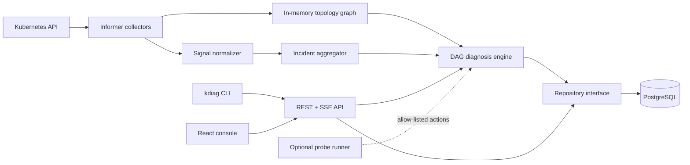

# Architecture

KDiag is an evidence-oriented diagnostic control plane. It separates read-only
collection, deterministic reasoning, persistence, and presentation so that a
conclusion can always be traced back to a bounded set of facts.

## Trust boundaries

The API uses read-only Kubernetes RBAC. Active probes are disabled by default
and are represented by typed actions, never shell strings. The optional probe
runner has a separate identity and concurrency/timeout controls. Secret bodies
are outside KDiag's data model. User input is validated at the API boundary and
database operations use parameters.

## Data flow

Informers emit resource changes keyed by Kubernetes UID. The graph updates edges
on add/update/delete. Events become normalized Signals and are deduplicated by
cluster, involved-object UID, reason, and normalized message. Findings and
Signals are correlated into Incidents. A diagnosis task executes an acyclic
sequence of rule steps and emits structured Evidence with supporting,
contradicting, missing, or neutral roles.

## Explainability contract

A hypothesis is never just a label. It includes confidence, supporting and
contradicting evidence IDs, missing evidence IDs, safe remediation, and a
verification plan. If required facts are unavailable the result is
`NEEDS_MORE_EVIDENCE`.

